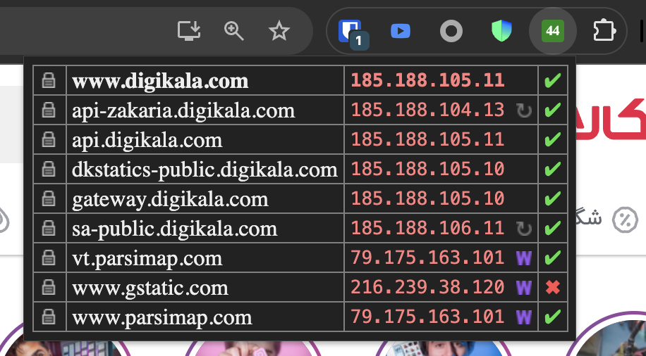

# CIDR Match — IP Range Checker

A fork of [pmarks-net/ipvfoo](https://github.com/pmarks-net/ipvfoo) that adds **custom CIDR rule matching** to the popup and color-codes the toolbar icon based on whether the current page's IP is in your ruleset.

> Available on the [Chrome Web Store](https://chromewebstore.google.com/detail/cidr-match-%E2%80%94-ip-range-che/pceglhjlcjljcbbdjphejdajiaiicgnc). Or use the [unpacked install](#install-unpacked) instructions below.



> **Use it to answer questions like:**
> "Is this server's IP in the range I think it should be in?"
> "Are all of this page's subresources coming from the CDN I expect?"
> "Is this domain inside or outside the list I'm tracking?"

In the screenshot above, every IP belonging to the main site's CDN is matched (green ✔) while a third-party asset is not (red ✖). The toolbar icon turned solid green because the main page's IP is in the ruleset — at-a-glance verification without opening the popup.

All the original IPvFoo behavior is preserved — when no rules are configured, the extension looks and acts 100% like upstream.

## Use cases

- **Split-tunnel VPN routing.** Your router/VPN client routes specific CIDRs over a different path. See at a glance whether the site you're on is using that path.
- **Allowlist / blocklist verification.** Paste your firewall's allowlist and immediately see whether a service is reachable through your network policy.
- **Geo / ASN sanity check.** Paste a country's IP allocation (e.g. from RIR / `ipverse` / `s4i.co` / etc.) and see whether sites really live where you think they do.
- **CDN debugging.** Paste your CDN's edge ranges to verify a request is hitting your CDN and not some origin.

## What it adds

- **Popup column.** Each row in the popup gets a 4th column showing **✔** (match), **✖** (no match), or **—** (not applicable — e.g. IPv6 row vs. IPv4-only rules). Hover for the matching CIDR and source line number.
- **Toolbar icon coloring.** The toolbar icon turns solid **green** when the current page's main IP matches a rule, solid **red** when it doesn't. The IPv4/IPv6 protocol character (`4`/`6`/`46`/`?`) is preserved on top in white. When no rules are configured, the icon is the stock IPvFoo protocol indicator — unchanged.
- **Options page section.** Paste your CIDR list once. Live "X rules loaded · Y skipped" status; expandable "skipped lines" panel for diagnosing rejected entries. Toggle whether "match" means **✔** or **✖**.
- **Permissive parser.** Drop in almost anything that contains CIDRs and the parser figures it out (see [Rule format](#rule-format)).
- **Zero network calls.** All matching happens locally in your browser. Nothing is logged, sent, or telemetry'd anywhere.

## Install (unpacked)

1. Clone or download this repo:
   ```bash
   git clone https://github.com/erfnzdeh/ipvfoo-rules.git
   ```
2. Open `chrome://extensions/` (or `edge://extensions/`), enable **Developer mode** in the top right, click **Load unpacked**, and select the `src/` directory.
3. Click the extension's **Details** → **Extension options**.
4. Paste your CIDR list into the **CIDR rules** textarea. Done.

To update: `git pull` and click the reload icon on the extension card.

> Firefox is supported via `src/manifest/firefox-manifest.json` (use the `use_firefox_manifest.sh.bat` script from upstream IPvFoo). Chrome/Edge is the primary target.

## Rule format

The parser accepts almost any text that contains IPv4 CIDRs, one per line. Lines without a CIDR are silently skipped (and counted in the "skipped" stat). Lines starting with `#`, `//`, or `;` are treated as comments.

All of these are accepted:

```text
# Plain CIDR notation
192.0.2.0/24
198.51.100.0/22

# Dotted netmask style
203.0.113.0/255.255.255.0

# Anything-with-a-CIDR-on-the-line (extra columns and prefixes are ignored)
some-label   192.0.2.0/24       2026-01-01
some-label   198.51.100.0/22    2026-01-01
```

Invalid lines (bad octets, non-contiguous netmasks, masks > 32, etc.) are skipped and shown in the **Show skipped lines** panel so you can debug your input.

IPv6 CIDRs are not currently supported; lines containing only an IPv6 address are skipped. IPv6 row IPs in the popup show **—** (gray dash) instead of ✔/✖.

## How matching is interpreted

The Options page lets you pick the meaning of "match":

| Setting | Match → | No match → | Mental model |
|---|---|---|---|
| **Match = ✔** (default) | green ✔ | red ✖ | "Is this IP in my list?" — checkmark means yes |
| **Match = ✖** | red ✖ | green ✔ | "My list is a blocklist" — match means hit |

The toolbar icon follows the same logic: green for ✔ row, red for ✖ row.

## Privacy

- The extension reuses upstream IPvFoo's `webRequest`-based IP capture — **no extra network traffic** is generated by the rule feature.
- The CIDR ruleset is stored in `chrome.storage.local` on your device only. It is not synced, uploaded, or sent anywhere.
- Matching is performed in pure JS, locally, per popup open and per icon update.
- No telemetry, no analytics, no external requests of any kind are added by this fork.

## Performance

The matcher does a simple linear scan: `(addr & mask) === network` per rule. With 2,000+ rules and 10–20 rows per popup, total matching time is under 1 ms. Icon rendering is cached per `(size, color, pattern)` tuple in the service worker.

## Building / running tests

The CIDR parser and matcher are pure functions and runnable under Node:

```bash
node --test tests/rules.test.js
```

No build step. No bundler. No dependencies.

## How this fork is organized

All new code lives in one new file (`src/rules.js`). Changes to existing files are wrapped in clearly-marked blocks:

```js
// === RULES ===
// (added code)
// === /RULES ===
```

This makes it easy to rebase on upstream IPvFoo releases.

## License

[Apache License 2.0](LICENSE) — inherited from upstream IPvFoo.
